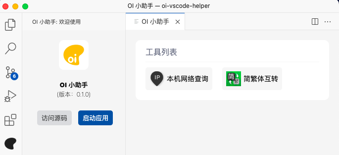
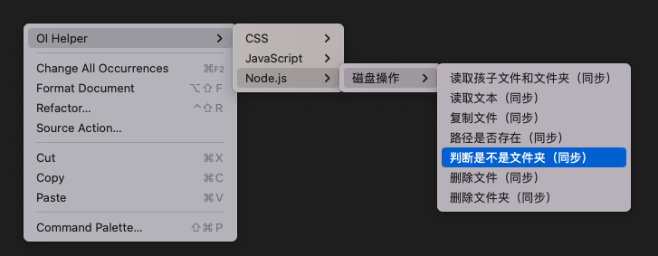
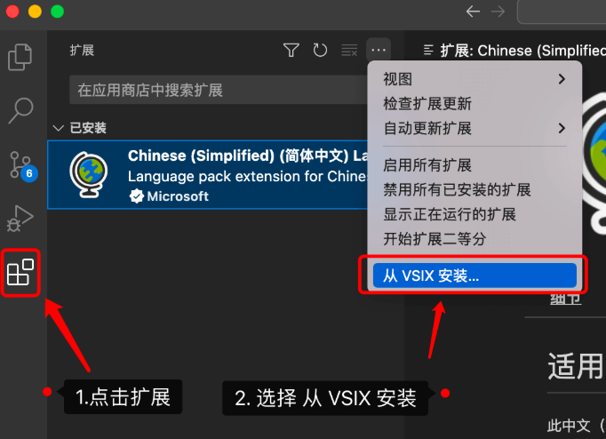

# OI 小助手
一个用于辅助日常工作的插件

<p>
    <a href="https://github.com/oi-contrib/oi-vscode-helper" target='_blank'>
        
    </a>
</p>





## 开发

开发阶段，只需要按下`F5`即可。

开发完毕后，准备打包的话，需要安装打包命令：

```
npm install -g vsce
```

然后执行命令：

```
vsce package
```

就可以得到打包后的vsix文件，比如： oi-vscode-helper-0.2.0.vsix

## 使用

点击扩展，选择从 VSIX 安装：



选中刚刚打包的vsix文件后即可完成安装。

## 版权

MIT License

Copyright (c) [zxl20070701](https://zxl20070701.github.io/notebook/home.html) 走一步，再走一步