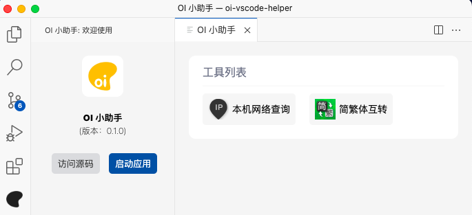

# OI 小助手
一个用于辅助日常工作的插件

> https://code.visualstudio.com/api



## 开发

开发阶段，只需要按下`F5`即可。

开发完毕后，准备打包的话，需要安装打包命令：

```
npm install -g vsce
```

然后执行命令：

```
vsce package
```

## 版权

MIT License

Copyright (c) [zxl20070701](https://zxl20070701.github.io/notebook/home.html) 走一步，再走一步